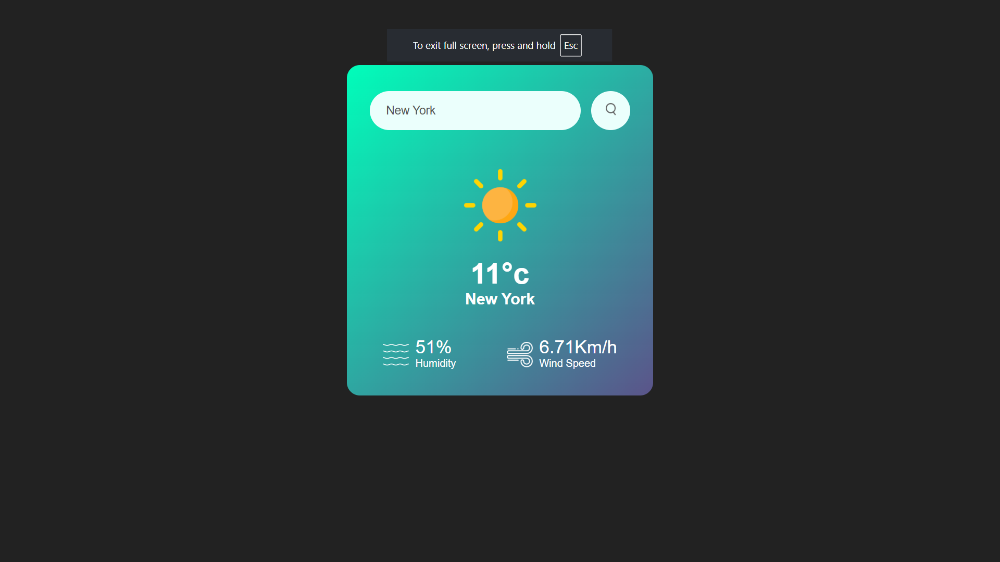

# 🌦️ Weather App

A simple, clean, and responsive **Weather App** that displays real-time weather information for any city using the **OpenWeatherMap API** (or your favorite weather source).

## 🚀 Features
- Search weather by city name
- Shows temperature, humidity, and wind-speed
- Beautiful weather icons for different weather condition
- Simple & minimalistic design (pure HTML + CSS)

## 🛠️ Technologies Used
- **HTML**
- **CSS**

## 📂 Folder Structure
Weather App/
├── images/ → weather icons or background images
├── index.html → main HTML file
├── style.css → styling file
└── README.md 

## 📸 Preview


## 💡 How to Use
1. Download or clone the repository:
   ```bash
   git clone https://github.com/<your-username>/weather-app.git
2. Open index.html in your browser.
3. Search for a city — boom! instant weather update ☀️🌧️

🌐 Live Demo
👉 [View on GitHub Pages](https://premkumar7516.github.io/weather-app/)


🧑‍💻 Author
**Prem Kumar**
✨ Feel free to fork this repo and improve it — maybe add JavaScript to fetch live data next?

---